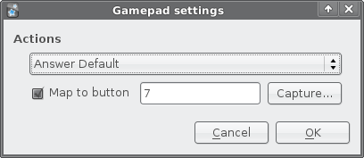

# AnkiJoy

This is a simple Python plugin I wrote for [Anki](http://ichi2.net/anki/) (the best
[SRS](http://en.wikipedia.org/wiki/Spaced_repetition) software ever) to enable Joystick and Gamepad support under Linux.
It relies on [PyQt](http://www.riverbankcomputing.co.uk/) which you already have installed if you run Anki, and
[pygame](http://www.pygame.org/) for game controller support. It can likely be made to work with a little bit of
tweaking on Windows and MacOS X systems, but I am not pursuing this at this time.

With this plugin you can map any of the following actions to arbitrary buttons on your favorite game controller:

*   Answer 1
*   Answer 2
*   Answer 3
*   Answer 4
*   Answer Default
*   Answer Incorrect
*   Bury Card
*   Mark Card
*   Repeat Audio
*   Show Answer
*   Suspend Card
*   Undo

If you wish to use this plugin simply download it from within the shared plugins menu in Anki or grab the latest
revision of the code from [GitHub](http://github.com/FooSoft/ankijoy/).

